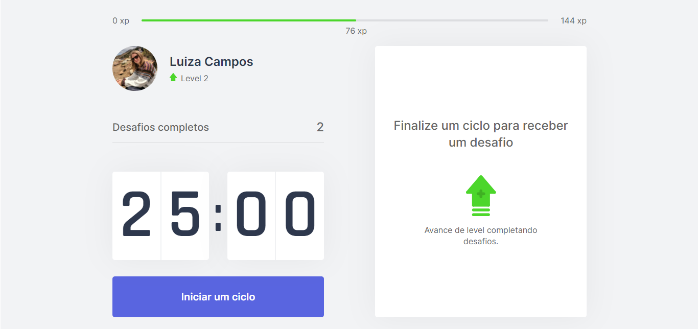
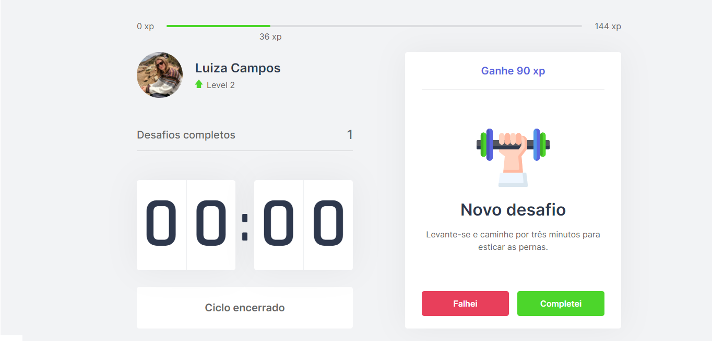

<h1  align="center"></h1>

<p></p>

### 🏠 [Clique aqui e veja a aplicação em ação!](https://nlw4-moveit-luizaacampos.vercel.app)

> 🚀 Move It é uma aplicação que estimula os devs a se movimentar!

<p align="center">
 <a href="#overview">Overview</a> •
 <a href="#demonstracao">Demonstração</a> •
 <a href="#comousar">Como usar</a> •
 <a href="#tecnologias">Tecnologias</a> • 
 <a href="#autora">Autora</a>
</p>

<h2 id="overview">✨ Overview</h2>

<p>
  Um cronômetro marca ciclos de 25 minutos de trabalho e ao fim de cada ciclo um desafio é fornecido. Ao completar o desafio o usuário ganha pontos e avança de nível. 

  Os desafios são exercícios de alongamento para o corpo e olhos, além de lembretes para beber água.

  A aplicação foi desenvolvida durante a Next Level Week #4 promovida pela Rocketseat. 🚀 
</p>

<h2 id="demonstracao">🖱 Demonstração</h2>

<p>
  <span></span>
  <span></span>
</p>

<h2 id="comousar">⚒️ Como usar</h2>

<h3>Pré-requisitos</h3>

<p>
    Antes de começar você vai precisar ter instalado em sua máquina as seguintes ferramentas:
    <ul>
      <li><a href="https://nodejs.org/en/">Node.js</a></li>
      <li><a href="https://yarnpkg.com/">Yarn</a></li>
    </ul>

    Também é bom ter um editor para trabalhar com o código como o 
  <a href="https://code.visualstudio.com/">VSCode</a>
</p>

<h3>Instalação</h3>
  <p>Abra esse projeto no seu editor de código ou no terminal do seu computador e execute o comando abaixo.</p>

  ```sh

yarn install

```

<h3>Rodando a aplicação</h3>
  <p>No terminal execute o comando abaixo.</p>

```sh

yarn dev

```

<p>A aplicação será aberta na porta:3000. No seu navegador acesse http://localhost:3000</p>


<h2 id="tecnologias">🛸 Tecnologias</h2>
  
  <p>
    As seguintes ferramentas foram usadas no desenvolvimento dessa aplicação:
    <ul>
      <li><a href="https://nodejs.org/en/">Node.js</a></li>
      <li><a href="https://pt-br.reactjs.org/">React.js</a></li>
      <li><a href="https://nextjs.org/">Next.js</a></li>
      <li><a href="https://www.typescriptlang.org/">TypeScript</a></li>
    </ul>
  </p>

  <h2 id="autora">👤 Autora</h2>

<h3>Desenvolvido com 💖 por Luiza Campos com auxílio da Rocketseat 🚀 </h3>

* [Linkedin](https://linkedin.com/in/luiza-de-almeida-campos)

  
<strong align="center">Não esqueça de deixar sua ⭐️</strong>

  
